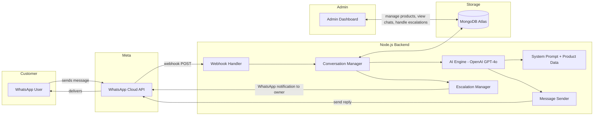
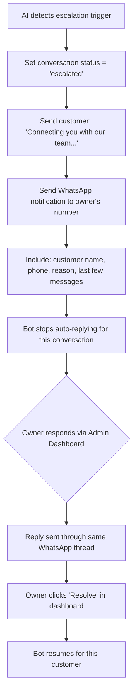
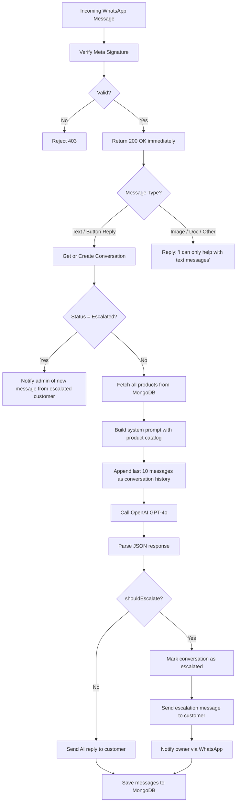

# Varni Enterprise — WhatsApp AI Chatbot

An AI-powered WhatsApp chatbot for Varni Enterprise (thermal packaging products) that automatically handles customer queries about products, pricing, and availability — escalating to the owner's WhatsApp only when necessary.

---

## High-Level Architecture



---

## Confirmed Requirements

| Requirement | Decision |
|:------------|:---------|
| **Language** | English only |
| **Pricing visibility** | Show exact prices from product data |
| **Escalation target** | Specific WhatsApp number (owner) |
| **Operating hours** | Bot runs 24/7, same behavior always |
| **Scope** | Product inquiries only (no order placement) |
| **Product count** | ~10 products |
| **Knowledge base** | No RAG/vector DB needed — full catalog embedded in system prompt |

---

## User Review Required

> [!IMPORTANT]
> **Product Data Input** — We need the actual product catalog from Varni Enterprise (product names, descriptions, specifications, pricing). For the initial build, we'll create a product management page in the admin dashboard where they can add/edit products. Should we start with placeholder/sample data, or will you provide the real catalog?

> [!IMPORTANT]
> **Deployment Target** — The webhook server needs a publicly accessible HTTPS endpoint. Recommended options:
> 1. **Railway** — Free tier with auto-HTTPS, simplest setup
> 2. **Render** — Free tier, auto-sleep on inactivity (may cause cold start delays)
> 3. **VPS** — More control, manual HTTPS setup
> 
> Which platform do you prefer? (We'll use **ngrok** for local development regardless.)

> [!WARNING]
> **Meta Business Setup** — Before going to production, Varni Enterprise needs:
> 1. A **Meta Business Account** (business.facebook.com)
> 2. A **WhatsApp Business Account** linked to their phone number
> 3. An **app** created in the Meta Developer Portal with the WhatsApp product added
> 4. A **System User Access Token** (permanent token) for production
> 
> Meta provides a free test phone number during development.

---

## Tech Stack

| Layer | Technology | Why |
|:------|:-----------|:----|
| **Runtime** | Node.js (v20+) | Fast async I/O, great for webhook handling |
| **Framework** | Express.js | Lightweight, well-documented |
| **AI** | OpenAI GPT-4o | Best balance of intelligence and cost |
| **Database** | MongoDB Atlas (free M0 tier) | Flexible schema for conversations + products |
| **WhatsApp** | Meta Cloud API (v22.0) | Direct integration, free service conversations |
| **Admin UI** | React (Vite) | Lightweight dashboard for management |
| **Dev Tunnel** | ngrok | Local webhook testing |

---

## Cost Estimate

| Service | Monthly Cost | Notes |
|:--------|:-------------|:------|
| WhatsApp Cloud API | **₹0** | Customer-initiated service conversations are free since Nov 2024 |
| OpenAI GPT-4o | **₹200–800** | ~500-1000 conversations/month × ~₹0.5-0.8 each |
| MongoDB Atlas | **₹0** | Free M0 tier (512MB storage) |
| Hosting | **₹0–400** | Free tier available; hobby plan ~$5/month for always-on |
| **Total** | **₹200–1,200/month** | For typical small business volume |

---

## Proposed Changes

### Project Structure

```
varni-enterprise-chatbot/
├── server/                          # Backend (Node.js + Express)
│   ├── src/
│   │   ├── index.js                 # App entry point — Express server + MongoDB connection
│   │   ├── config/
│   │   │   └── env.js               # Environment variable loader + validation
│   │   ├── routes/
│   │   │   ├── webhook.routes.js    # /webhook — Meta webhook endpoints
│   │   │   └── admin.routes.js      # /api/admin/* — Dashboard API endpoints
│   │   ├── services/
│   │   │   ├── whatsapp.service.js  # Send messages via Meta Cloud API
│   │   │   ├── openai.service.js    # OpenAI Chat Completions + dynamic system prompt
│   │   │   ├── conversation.service.js  # Conversation state + history management
│   │   │   └── escalation.service.js    # Human handoff + owner notification
│   │   ├── models/
│   │   │   ├── conversation.model.js    # Mongoose: conversations + message history
│   │   │   ├── product.model.js         # Mongoose: product catalog
│   │   │   └── escalation.model.js      # Mongoose: escalation records
│   │   ├── prompts/
│   │   │   └── system.js            # System prompt builder (injects live product data)
│   │   ├── middleware/
│   │   │   └── signature.js         # Meta webhook X-Hub-Signature-256 verification
│   │   └── utils/
│   │       ├── logger.js            # Structured logging (winston)
│   │       └── messageParser.js     # Parse incoming WhatsApp message types
│   ├── package.json
│   ├── .env.example
│   └── .gitignore
│
├── dashboard/                        # Admin Dashboard (React + Vite)
│   ├── src/
│   │   ├── App.jsx
│   │   ├── main.jsx
│   │   ├── pages/
│   │   │   ├── Dashboard.jsx         # Stats: messages today, active chats, pending escalations
│   │   │   ├── Conversations.jsx     # View all conversations + full thread viewer
│   │   │   ├── Escalations.jsx       # Handle escalated conversations (reply + resolve)
│   │   │   └── Products.jsx          # Add/Edit/Delete products in the catalog
│   │   ├── components/
│   │   │   ├── ChatThread.jsx        # Render a single conversation thread
│   │   │   ├── StatsCard.jsx         # Metric display card
│   │   │   ├── ProductForm.jsx       # Form for adding/editing products
│   │   │   └── Sidebar.jsx           # Navigation sidebar
│   │   └── index.css
│   ├── package.json
│   └── vite.config.js
│
└── README.md
```

---

### Component 1: Webhook Handler & Meta Integration

The entry point — receives all incoming WhatsApp messages.

#### [NEW] [webhook.routes.js](file:///c:/Users/meetv/Desktop/varni-enterprise-chatbot/server/src/routes/webhook.routes.js)
- **GET `/webhook`** — Verification endpoint for Meta. Validates `hub.verify_token`, returns `hub.challenge`.
- **POST `/webhook`** — Receives incoming events.
  - Returns `200 OK` immediately (Meta requires response within 5s).
  - Extracts: message type, sender phone, message body, message ID, sender name.
  - Passes to Conversation Service for async processing.
  - Deduplicates retried messages using message ID.

#### [NEW] [whatsapp.service.js](file:///c:/Users/meetv/Desktop/varni-enterprise-chatbot/server/src/services/whatsapp.service.js)
- `sendTextMessage(to, text, replyToMessageId?)` — Sends a text reply via `POST /v22.0/{PHONE_NUMBER_ID}/messages`.
- `sendInteractiveButtons(to, body, buttons[])` — Quick reply buttons (max 3) for structured responses.
- `markAsRead(messageId)` — Marks incoming message as read (blue ticks).
- All calls use `Authorization: Bearer {WHATSAPP_TOKEN}` header.

#### [NEW] [signature.js](file:///c:/Users/meetv/Desktop/varni-enterprise-chatbot/server/src/middleware/signature.js)
- Verifies `X-Hub-Signature-256` header against `APP_SECRET`.
- Rejects requests that don't pass signature check (prevents spoofing).

---

### Component 2: AI Engine (OpenAI)

The brain — understands customer queries and generates accurate product-focused responses.

#### [NEW] [openai.service.js](file:///c:/Users/meetv/Desktop/varni-enterprise-chatbot/server/src/services/openai.service.js)
- `generateResponse(userMessage, conversationHistory)`:
  1. Fetches all products from MongoDB.
  2. Builds system prompt with full product catalog injected.
  3. Calls `openai.chat.completions.create()` with `gpt-4o` model.
  4. Messages array: `[system, ...last 10 conversation messages, user message]`
  5. Parses structured response: `{ reply: string, shouldEscalate: boolean, escalationReason?: string }`

#### [NEW] [system.js](file:///c:/Users/meetv/Desktop/varni-enterprise-chatbot/server/src/prompts/system.js)
- `buildSystemPrompt(products[])` — Dynamically generates the system prompt:

```
You are Varni — a helpful, friendly sales assistant for Varni Enterprise,
specialists in thermal packaging solutions.

YOUR ROLE:
- Answer customer questions about products, prices, specifications, and availability
- Provide exact pricing as listed in the product catalog
- Help customers find the right product for their needs
- Be concise — this is WhatsApp, keep responses short and clear

PRODUCT CATALOG:
{dynamically injected product data from MongoDB}

RULES:
1. ONLY answer questions based on the product catalog above
2. Share exact prices as listed — do not negotiate or offer discounts
3. If asked about something not in the catalog, politely say you don't have that information
4. If the customer wants to place an order, negotiate pricing, or has a complaint,
   set shouldEscalate to true
5. If the customer explicitly asks to speak to a person/human, set shouldEscalate to true
6. Keep responses under 300 characters when possible (WhatsApp readability)

RESPOND IN THIS JSON FORMAT:
{ "reply": "your message to the customer", "shouldEscalate": false, "escalationReason": null }
```

> [!NOTE]
> **Why embed products in the system prompt?** With only ~10 products, the entire catalog fits easily in the context window (~1-2KB). This eliminates the need for RAG, vector search, or any retrieval step. The AI has perfect knowledge of all products in every conversation. When products are updated via the admin dashboard, the next conversation automatically uses the updated data.

---

### Component 3: Product Management (MongoDB-backed)

Simple CRUD for the ~10 products. Admin updates products via dashboard → system prompt auto-rebuilds.

#### [NEW] [product.model.js](file:///c:/Users/meetv/Desktop/varni-enterprise-chatbot/server/src/models/product.model.js)
```javascript
{
  name: String,           // "Standard Thermal Roll 79mm x 40m"
  category: String,       // "Thermal Rolls"
  description: String,    // "High-quality thermal paper for billing machines"
  specifications: {       // Flexible key-value specs
    width: String,
    length: String,
    core: String,
    // ... any other specs
  },
  price: String,          // "₹45 per roll"  or  "₹45 - ₹55 per roll (quantity based)"
  moq: String,            // "100 rolls"
  inStock: Boolean,       // true/false
  applications: [String], // ["POS billing", "ATM", "Retail"]
  createdAt, updatedAt    // Timestamps
}
```

#### Admin API for Products
- `GET /api/admin/products` — List all products
- `POST /api/admin/products` — Add a new product
- `PUT /api/admin/products/:id` — Update a product
- `DELETE /api/admin/products/:id` — Remove a product

When any product is updated, the system prompt is rebuilt on the next incoming message with fresh data.

---

### Component 4: Conversation Management

Tracks ongoing conversations and maintains chat history for AI context.

#### [NEW] [conversation.service.js](file:///c:/Users/meetv/Desktop/varni-enterprise-chatbot/server/src/services/conversation.service.js)
- `getOrCreateConversation(phoneNumber, customerName)` — Finds or creates a conversation.
- `addMessage(conversationId, role, content)` — Appends to message history.
- `getRecentHistory(conversationId, limit=10)` — Returns last N messages for OpenAI context.
- `setEscalated(conversationId, reason)` — Marks as escalated, bot stops auto-replying.
- `resolveEscalation(conversationId)` — Admin resolves, bot resumes.

#### [NEW] [conversation.model.js](file:///c:/Users/meetv/Desktop/varni-enterprise-chatbot/server/src/models/conversation.model.js)
```javascript
{
  phoneNumber: String,      // Customer's WhatsApp number (indexed)
  customerName: String,     // From WhatsApp profile
  messages: [{
    role: 'user' | 'assistant',
    content: String,
    timestamp: Date
  }],
  status: 'active' | 'escalated' | 'resolved',
  escalationReason: String,
  lastMessageAt: Date,
  createdAt, updatedAt
}
```

---

### Component 5: Escalation & Human Handoff

When AI can't handle a query, it escalates to the owner's WhatsApp.

#### [NEW] [escalation.service.js](file:///c:/Users/meetv/Desktop/varni-enterprise-chatbot/server/src/services/escalation.service.js)

**Escalation Triggers** (detected by AI via system prompt instructions):
1. Customer explicitly asks for a human / agent
2. Bulk order or custom pricing negotiation
3. Complaints or negative sentiment
4. Query outside the product catalog that AI can't answer (2+ "I don't know" responses)
5. Order placement requests

**Escalation Flow:**


**Owner Notification Message Format:**
```
🚨 *Escalation Alert*

Customer: {name}
Phone: {phone}
Reason: {reason}

Last message: "{customer's last message}"

Reply via the admin dashboard:
{dashboard_url}/escalations/{id}
```

---

### Component 6: Admin Dashboard

A clean, simple dashboard for Varni Enterprise to manage everything.

#### Pages

| Page | Purpose |
|:-----|:--------|
| **Dashboard** | Stats: messages today, active conversations, pending escalations, total products |
| **Conversations** | List + search all conversations, click to view full thread |
| **Escalations** | Queue of escalated conversations — reply to customer + resolve |
| **Products** | Add / Edit / Delete products in the catalog |

#### Admin API Routes

```
GET    /api/admin/stats                    — Dashboard metrics
GET    /api/admin/conversations            — List conversations (paginated, searchable)
GET    /api/admin/conversations/:id        — Full conversation thread
POST   /api/admin/conversations/:id/reply  — Reply as business (sends via WhatsApp API)
PATCH  /api/admin/conversations/:id/resolve — Resolve an escalation (bot resumes)
GET    /api/admin/products                 — List all products
POST   /api/admin/products                 — Add product
PUT    /api/admin/products/:id             — Update product
DELETE /api/admin/products/:id             — Delete product
```

---

### Component 7: Core Message Flow

The complete processing pipeline for every incoming message:



---

## Implementation Phases

### Phase 1 — Core Bot (MVP) ⏱️ ~3 days
1. Project setup (Node.js, Express, MongoDB connection, env config)
2. Meta webhook handler (GET verification + POST message handling)
3. Webhook signature verification middleware
4. WhatsApp message sending service (text + interactive buttons)
5. OpenAI integration with dynamic system prompt (products injected)
6. Conversation tracking + history in MongoDB
7. Escalation flow: detect → notify owner via WhatsApp → stop bot
8. Product model + seed with sample data
9. Test locally with ngrok + Meta test number

### Phase 2 — Admin Dashboard ⏱️ ~2 days
1. React + Vite project setup
2. Dashboard overview page (stats cards)
3. Conversations list + thread viewer
4. Escalations page (reply + resolve)
5. Products CRUD page (add/edit/delete)
6. Connect to backend API

### Phase 3 — Polish & Deploy ⏱️ ~1 day
1. Error handling, rate limiting, message deduplication
2. Logging with winston
3. Deploy to production (Railway/Render)
4. Connect production WhatsApp Business number
5. End-to-end testing with real messages

---

## Environment Variables

```env
# Meta WhatsApp Cloud API
WHATSAPP_TOKEN=                  # System User Access Token (permanent)
WHATSAPP_PHONE_NUMBER_ID=        # From Meta Developer Portal
WHATSAPP_VERIFY_TOKEN=           # Custom string for webhook verification
WHATSAPP_APP_SECRET=             # For X-Hub-Signature-256 verification
ADMIN_PHONE_NUMBER=              # Owner's WhatsApp number for escalation alerts

# OpenAI
OPENAI_API_KEY=                  # OpenAI API key

# MongoDB
MONGODB_URI=                     # MongoDB Atlas connection string

# Server
PORT=3000
NODE_ENV=development
```

---

## Verification Plan

### Automated Tests
- Webhook verification: mock GET with correct/incorrect verify tokens
- Message parsing: unit tests for text, button reply, status update message types
- AI response: verify structured JSON output with `reply` + `shouldEscalate`
- Escalation triggers: test keyword detection and state transitions

### Manual Verification (ngrok + Meta test number)
1. **Product queries**: "What products do you have?", "Price of 79mm roll?", "Do you deliver?"
2. **Multi-turn conversation**: Follow-up questions use context correctly
3. **Escalation**: "I want to talk to someone" → bot stops, owner gets WhatsApp notification
4. **Out-of-scope**: "What's the weather?" → polite deflection
5. **Admin dashboard**: Products CRUD works, conversations visible, escalation reply + resolve works
6. **Edge cases**: Empty messages, rapid messages, media messages (graceful handling)
